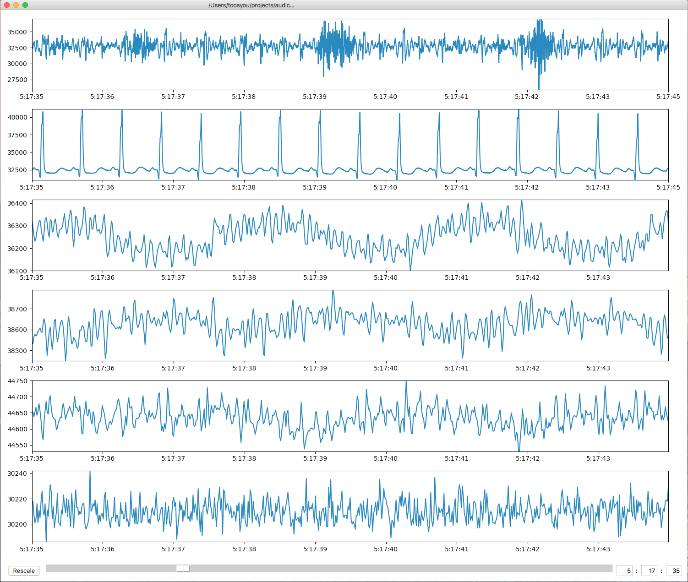

# Audicor Reader
Python script for reading EKG or heart-sounds files from Audicor.

## Dependency
* python3
  * [numpy](http://www.numpy.org/)
  * [matplotlib](https://matplotlib.org/)
  * [scipy](https://www.scipy.org/)
  * [PyWavelets](https://github.com/PyWavelets/pywt)
  * [tensorflow](https://www.tensorflow.org/)
  * [keras](https://keras.io/)

Install dependency by [pip3](https://pypi.org/project/pip/):
```
pip3 install --user -r requirements.txt
```

## Usage
### Script
```
$ python3 reader.py -h                                    
usage: reader.py [-h] [-sx SIZE_X] [-sy SIZE_Y] [-st START_TIME]
                 [-et END_TIME] [-fsg] [-dn] [-sg]
                 filename

Produce ekg and heart_sound figure.

positional arguments:
  filename              Filename to read. Must be *.bin or *.raw (case-
                        insensitive).

optional arguments:
  -h, --help            show this help message and exit
  -sx SIZE_X, --size-x SIZE_X
                        X-axis size of saved figure. (default: 20)
  -sy SIZE_Y, --size-y SIZE_Y
                        Y-axis size of saved figure. (default: 20)
  -st START_TIME, --start-time START_TIME
                        Start time of plt. Only works with *.raw. (default:
                        0:0:0)
  -et END_TIME, --end-time END_TIME
                        End time of plt. Only works with *.raw. (default:
                        23:59:59)
  -fsg, --force-spectrogram
                        Calculate spectrogram of which has the data length
                        longer than 60s.
  -dn, --denoise        Apply wavelet thresholding and high-pass filter to ekg
                        for denoising.
  -sg, --segment        Apply segmentation to ekg.
```
#### Example
* EKG
  * `python3 reader.py --denoise some_ekg.bin`
* Heart sounds
  * `python3 reader.py some_heart_sounds.raw -st 4:0:0 -et 4:0:20`

### Module
```python3
from reader import get_ekg, get_heart_sounds

if __name__ == '__main__':
    ekg_filename = '/somewhere/to/ekg/file.bin'
    heart_sounds_filename = '/somewhere/to/heart_sounds/file.raw'

    ekg_data, ekg_sampling_rates = get_ekg(ekg_filename)
    heart_sounds_data, hs_sampling_rates = get_heart_sounds(heart_sounds_filename)
```
# RAW Data Visulization Tool


## Usage
Use the following instruction to open gui:
```python3
python3 gui.py
```

1. Drag and drop *.raw file into the window to visualize that file.
1. Investigation time interval selection:
    * Through scrollbar at the bottom
    * Press `LEFT` or `RIGHT` arrowkey on the keyboard
    * Or type in the specified time in the boxes on the right, and press `Enter`
1. Press 「Rescale」 button on the left or press `spacebar` to reset the scale of visulization.
1. Press `UP` or `DOWN` arrowkey on the keyboard to change time interval of visulization.
1. If you want to change file, drag and drop new file in again.
1. Enjoy!
